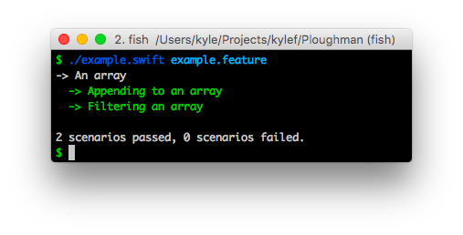

# Ploughman

Ploughman is Swift implementation of Cucumber, a test runner for the Gherkin language.

> Cucumber is a tool for running automated tests written in plain language.
> Because they're written in plain language, they can be read by anyone on
> your team. Because they can be read by anyone, you can use them to help
> improve communication, collaboration and trust on your team.

## Example

You can write tests in Gherkin, here's an example:

```cucumber
Feature: An array

    Scenario: Appending to an array
        Given I have an empty array
         When I add 1 to the array
         Then I should have 1 item in the array

    Scenario: Filtering an array
        Given I have an array with the numbers 1 though 5
         When I filter the array for even numbers
         Then I should have 2 items in the array
```

You can then write implementations of these rules in Swift:

```swift
var array: [Int] = []

given("^I have an empty array$") { match in
  array = []
}

given("^I have an array with the numbers (\\d) though (\\d)$") { match in
  let start = match.groups[1]
  let end = match.groups[2]

  array = Array(Int(start)! ..< Int(end)!)
}

when("^I add (\\d) to the array$") { match in
  let number = Int(match.groups[1])!
  array.append(number)
}

when("^I filter the array for even numbers$") { match in
  array = array.filter { $0 % 2 == 0 }
}

then("^I should have (\\d) items? in the array$") { match in
  let count = Int(match.groups[1])!
  try expect(array.count) == count
}
```

Then you can run your rules agains your feature files as follows:



### Running the example yourself

To run the example yourself, you will first need
[Conche](https://github.com/kylef/Conche) to download the dependencies.

```shell
$ conche test
$ ./example.swift example.feature
-> An array
  -> Appending to an array
    -> Filtering an array

2 scenarios passed, 0 scenarios failed.
```

## Usage

To use Ploughman, you will need to build a command line tool that adds the
rules required for your implementation and then calls `ploughman.run()` to
start the runner.

You will need to make the Ploughman dependency available for your command line tool.

```swift
import Ploughman

var array: [Int] = []

given("^I have an empty array$") { match in
  array = []
}

when("^I add (\\d) to the array$") { match in
  let number = Int(match.groups[1])!
  array.append(number)
}

then("^I should have (\\d) items? in the array$") { match in
  let count = Int(match.groups[1])!
  if array.count != count {
    throw /* some error indicating the failure */
  }
}

ploughman.run()
```

At any step, you can raise and an error to indicate a failure.
